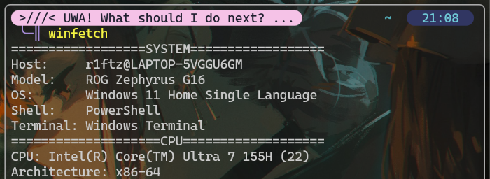

# WinFetchPlus

A lightweight neofetch-style system info tool for Windows, written in C.

Still simple but more advanced than old [WinFetch](https://github.com/METE0R4/WinFetch).



## Requirements

- GCC
- make

Feel free to try out [dev_setup](https://github.com/TaH00R/dev_setup) for a one-stop way to install the tools you need.

## Setup

- Clone/download the repo and go into that folder
- Open the terminal and run:

```
make
```

- This will use the config in ~~`main.c`~~ `config.c`
- Your exe will be in the `/bin` folder to use
- Add bin path to your environment variables to use from anywhere
- Run using optional logo arguement

```
winfetch [logo_name]
```

## Customization

Edit `config.c` to your liking using the available functions. All functions return a string, so they work directly inside `snprintf`.
For logos, you can use the few given in `/logos` or add new one new ascii art!

[Epic tool to generate ASCII art](https://github.com/nishchay-joshi/ascii-generator-cli)

### Available functions

- `get_user()` — Your username (e.g. `r1ftzy`)
- `get_hostname()` — Your system name (e.g. `LAPTOP-XXXXXXX`)
- `get_device()` — Your device model (e.g. `ROG Zephyrus G16 GU605MV_GU605MV`)
- `get_device_clean()` — Cleaner device name (e.g. `ROG Zephyrus G16`)
- `get_architecture()` — CPU architecture (e.g. `x86-64`, `ARM64`)
- `get_logical_cores()` — Number of logical cores/threads (e.g. `22`)
- `get_cpu()` — Full CPU name (e.g. `Intel(R) Core(TM) Ultra 7 155H`)
- `get_os()` — Full OS version (e.g. `Windows 11 Home Single Language`)
- `get_os_clean()` — Shorter OS name (e.g. `Windows 11`)
- `get_shell()` — Current shell (e.g. `PowerShell`)
- `get_terminal()` — Current terminal (e.g. `Windows Terminal`)
- `get_resolution_primary()` — Primary display resolution (e.g. `2560x1600`)
- `get_refresh_rate()` — Display refresh rate (e.g. `60`)
- `get_ram_total()` — Total RAM (e.g. `16.00 GiB`)
- `get_ram_used()` — Used RAM (e.g. `8.23 GiB`)
- `get_ram_available()` — Available RAM (e.g. `7.77 GiB`)
- `get_battery_percentage()` — Current charge (e.g. `51%`)
- `get_battery_status()` — Charging or discharging (e.g. `Discharging`)
- `get_battery_rate()` — Current rate (e.g. `10.5W`)
- `get_battery_life()` — Time remaining on battery (e.g. `2Hr 30min`, `N/A` when charging)
- `get_battery_max_capacity()` — Max battery capacity (e.g. `90.12Wh`)
- `get_gpu()` — Full GPU name (e.g. `NVIDIA GeForce RTX 4060 Laptop GPU`)
- `get_vram()` — Total VRAM (e.g. `8.00 GiB`)

## Contributing

You're free to do anything with it!

The use gen AI is fine but it is discouraged to depend on it 100%. Reading and understanding what the AI generated before submitting goes a long way <3
